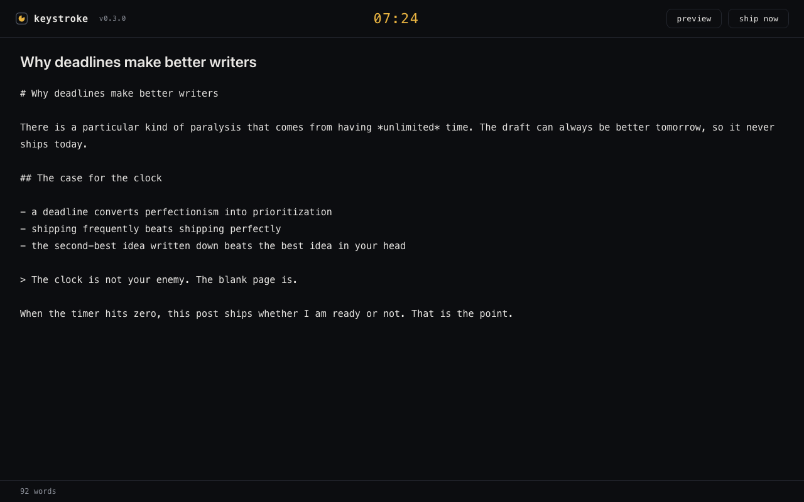
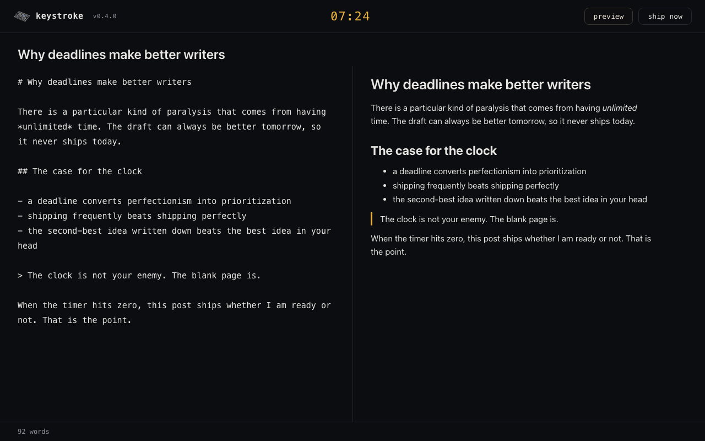
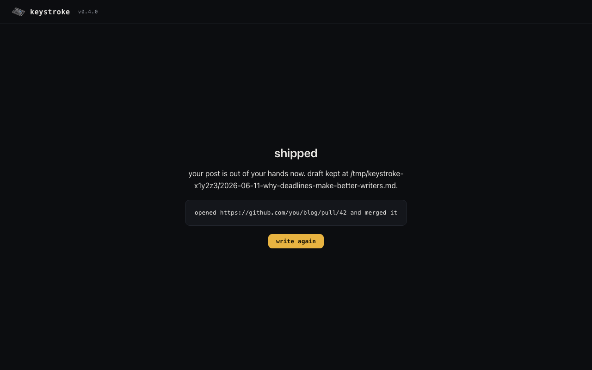

# keystroke

a timer-boxed writing app. pick how long you have, write in markdown, and
when the clock hits zero your post ships through a hook you provide. no
extensions, no drafts rotting in a folder. the deadline is the editor.

## how it works

1. you point keystroke at an executable (the hook)
2. you pick a duration: 10, 15, 30, 45, or 60 minutes
3. you write, with an optional live markdown preview
4. at zero, keystroke writes your post to a markdown file and runs your hook
   with it

the hook is required. keystroke will not let you write without one, because a
post with nowhere to go is just a draft.

## examples







## install

requires node >= 20.

```sh
git clone https://github.com/iteratedcomputing/keystroke.git
cd keystroke
npm install
```

## run

just trying it out? start with the bundled word-count hook, which counts
your words and publishes nothing:

```sh
make demo
```

for real use, create a hook (any executable works). start from the
word-count example and overwrite it with your own publishing logic:

```sh
cp hooks/wordcount.sh hook
chmod +x hook
```

then start the app and open http://localhost:7777:

```sh
make dev
```

your hook stays yours: `./hook` and `hooks/local/` are gitignored, so
personal hooks never end up in the repo. set `KEYSTROKE_HOOK` to use hooks
anywhere else, and `PORT` to change the port.

## the hook

your hook receives the finished post as a markdown file path in `$1`, plus
`KEYSTROKE_TITLE`, `KEYSTROKE_SLUG`, and `KEYSTROKE_DURATION_MINUTES` in the
environment. exit 0 means published; anything else surfaces the failure in
the ui with your draft path so nothing is lost.

chain hooks by separating paths with colons. they run in order, and each
must exit 0 before the next starts:

```sh
export KEYSTROKE_HOOK=./hooks/front-matter.sh:./hooks/publish.sh
```

see [docs/hooks.md](docs/hooks.md) for the full contract and a
publish-to-blog example.

## development

```sh
make format   # prettier
make test     # node --test
make build    # no-op, nothing to compile
make dev      # run the server
make demo     # run the server with the bundled word-count hook
```
